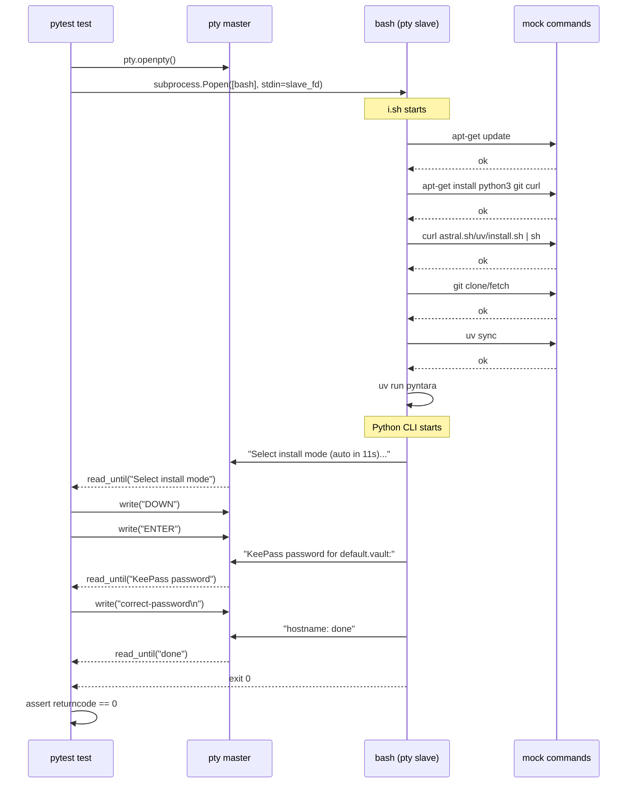

# Архитектура тестирования полного bootstrap-потока Pyntara

**Утверждено.** Реализуются Layer 1 и Layer 2. Layer 3 (Docker) исключён.
Фокус на сценарии доставки через git-репозиторий (`curl ... i.sh | sudo bash`).

## 1. Цель

Автоматически тестировать поведение пользователя, выполняющего команду:

```bash
curl -fsSL https://raw.githubusercontent.com/Borodin-Atamanov/Pyntara/main/i.sh | sudo bash
```

и взаимодействующего со скриптом через консоль (клавиатура + терминал).

## 2. Анализ потока выполнения

### 2.1 Bash-фаза (`i.sh`)

```
curl ... i.sh | sudo bash
         │
         ▼
    ┌─────────────┐
    │ Проверка root│  ← set -euo pipefail, EUID check
    └──────┬──────┘
           ▼
    ┌─────────────┐
    │ verify_env  │  ← /etc/os-release check
    └──────┬──────┘
           ▼
    ┌─────────────┐
    │ apt-get     │  ← python3, git, curl, python3-venv
    └──────┬──────┘
           ▼
    ┌─────────────┐
    │ install uv  │  ← curl https://astral.sh/uv/install.sh | sh
    └──────┬──────┘
           ▼
    ┌─────────────┐
    │ expose_uv   │  ← symlink for user
    └──────┬──────┘
           ▼
    ┌─────────────┐
    │ workspace   │  ← git clone/fetch → tar → workspace dir
    └──────┬──────┘
           ▼
    ┌─────────────┐
    │ uv sync     │  ← bootstrap_python_env
    └──────┬──────┘
           ▼
    ┌─────────────┐
    │ run_pyntara │  ← uv run pyntara < /dev/tty
    └─────────────┘
```

**Ключевой момент:** stdin скрипта — это pipe (содержимое `i.sh`). Для интерактивного ввода CLI скрипт открывает `/dev/tty` отдельно (строка 351: `exec 3<"${PYNTARA_CLI_STDIN_PATH}"`).

### 2.2 Python-фаза (`cli.py`)

```
    ┌─────────────┐
    │ Load config │  ← config.yaml, tasks.yaml, install_modes.yaml
    └──────┬──────┘
           ▼
    ┌─────────────┐
    │ Secrets     │  ← default.vault (KeePass) или production.vault
    └──────┬──────┘
           ▼
    ┌─────────────┐
    │ Mode select │  ← interactive: arrows + Enter, или auto-timeout 11s
    └──────┬──────┘
           ▼
    ┌─────────────┐
    │ Task select │  ← из install_modes.yaml по выбранному режиму
    └──────┬──────┘
           ▼
    ┌─────────────┐
    │ Task runner │  ← выполняет задачи по порядку
    └─────────────┘
```

### 2.3 Точки взаимодействия с пользователем

| Точка | Тип ввода | Механизм | Таймаут |
|-------|-----------|----------|---------|
| Выбор режима установки | Стрелки + Enter | `tty.setcbreak()` + `select.select()` | 11 секунд |
| Пароль KeePass | Скрытый текст | `getpass.getpass()` | 30s KDF + 3 попытки |
| Вывод задач | Текст | `typer.echo()` | N/A |

## 3. Предлагаемая архитектура: многослойное тестирование

### 3.1 Общая схема

```
┌─────────────────────────────────────────────────────────────┐
│                    Layer 3: Docker E2E                       │
│  (опционально, для CI)                                      │
│  Реальный Ubuntu 26.04, реальные apt/git/uv                 │
│  env PYNTARA_VAULT_PASSWORD=test                            │
├─────────────────────────────────────────────────────────────┤
│                    Layer 2: PTY bash tests                   │
│  bash i.sh через PTY, мокнутые apt/git/uv                   │
│  Симуляция нажатий клавиш и ввода пароля                    │
├─────────────────────────────────────────────────────────────┤
│                    Layer 1: PTY Python CLI tests             │
│  uv run pyntara через PTY                                   │
│  Симуляция mode selection + password prompt                 │
├─────────────────────────────────────────────────────────────┤
│                    Layer 0: Unit tests (существующие)        │
│  mode_selector, secrets_store, config_loader, task_runner   │
└─────────────────────────────────────────────────────────────┘
```

### 3.2 Layer 0: Unit-тесты (существующие, расширить)

Уже покрыто:
- `test_mode_selector.py` — все варианты навигации и auto-select
- `test_secrets_store.py` — KeePass/YAML, правильный/неправильный пароль
- `test_bootstrap_script.py` — bash-логика с мокнутыми командами
- `test_cli.py` — KDF timeout, env var password

**Что добавить:**
- Тест на `_password_from_env_or_prompt()` при наличии/отсутствии `PYNTARA_VAULT_PASSWORD`
- Тест на `_interactive_prompt_available()` когда `/dev/tty` недоступен
- Тест на `run_pyntara()` функцию bash-скрипта с мокнутым `/dev/tty`

### 3.3 Layer 1: PTY-тесты Python CLI (НОВЫЙ ФАЙЛ: `tests/test_interactive_cli.py`)

**Идея:** Запускаем `uv run pyntara` через псевдо-терминал (PTY), симулируем нажатия клавиш и читаем вывод.

```python
# tests/test_interactive_cli.py

import os
import pty
import time
import subprocess
from pathlib import Path

import pytest


@pytest.fixture
def test_workspace(tmp_path: Path, fast_kdbx: tuple[Path, str]) -> Path:
    """Create a minimal workspace with config files and a test KeePass vault."""
    vault_path, password = fast_kdbx
    secrets_dir = tmp_path / "secrets"
    secrets_dir.mkdir()
    import shutil
    shutil.copy2(str(vault_path), str(secrets_dir / "default.vault"))
    
    # config.yaml
    (tmp_path / "config.yaml").write_text(
        f"paths:\n  secrets_dir: {secrets_dir}\n  task_data_dir: {tmp_path / 'task_data'}\n"
        f"timeouts:\n  command_sec: 30\n  task_sec: 60\n"
        f"logging:\n  command_output_to_console: false\n  command_output_to_log: false\n"
    )
    # tasks.yaml
    (tmp_path / "tasks.yaml").write_text(
        "tasks:\n  - name: hostname\n    order: 10\n    description: Test\n"
        "    module: pyntara.tasks.hostname:run\n    idempotent: true\n"
        "    default_enabled: true\n    timeout_sec: 30\n    depends_on: []\n"
    )
    # install_modes.yaml
    (tmp_path / "install_modes.yaml").write_text(
        "minimal:\n  - hostname\nserver:\n  - hostname\ndesktop:\n  - hostname\n"
        "default_desktop_mode: minimal\ndefault_server_mode: minimal\n"
        "auto_select_timeout_sec: 2\n"
    )
    return tmp_path
```

**Тестовые сценарии Layer 1:**

| # | Сценарий | Ввод | Ожидаемый результат |
|---|----------|------|---------------------|
| 1.1 | Auto-select режима + правильный пароль | Ничего не нажимать, ждать timeout → пароль через env | Режим выбран, задачи выполнены, exit 0 |
| 1.2 | Ручной выбор режима + правильный пароль | DOWN + ENTER → пароль через env | Выбран desktop, exit 0 |
| 1.3 | Неправильный пароль (интерактивный) | ENTER (default mode) → wrong password ×3 | exit 1, "password attempts exhausted" |
| 1.4 | Правильный пароль через getpass | ENTER → correct password | exit 0 |
| 1.5 | Прерывание по Ctrl+C | Сигнал SIGINT | exit 130 или корректное завершение |

**Реализация PTY-взаимодействия:**

```python
class PtySession:
    """Manage a PTY-based subprocess with scripted input/output."""

    def __init__(self, cmd: list[str], cwd: Path, env: dict[str, str]) -> None:
        self.master_fd, slave_fd = pty.openpty()
        self.proc = subprocess.Popen(
            cmd,
            stdin=slave_fd,
            stdout=slave_fd,
            stderr=slave_fd,
            cwd=cwd,
            env=env,
            close_fds=True,
        )
        os.close(slave_fd)
        self._output = b""
        self._deadline = time.monotonic() + 30

    def read_until(self, marker: bytes, timeout: float = 10) -> bytes:
        """Read PTY output until marker is found."""
        deadline = time.monotonic() + timeout
        while time.monotonic() < deadline:
            if self._proc_done():
                break
            try:
                chunk = os.read(self.master_fd, 4096)
                self._output += chunk
                if marker in self._output:
                    return self._output
            except BlockingIOError:
                time.sleep(0.05)
        raise TimeoutError(f"Marker {marker!r} not found in {self._output!r}")

    def write(self, data: bytes) -> None:
        os.write(self.master_fd, data)

    def close(self) -> None:
        os.close(self.master_fd)
        self.proc.wait(timeout=5)
```

### 3.4 Layer 2: PTY-тесты bash-скрипта (НОВЫЙ ФАЙЛ: `tests/test_bootstrap_pty.py`)

**Идея:** Запускаем `bash` с содержимым `i.sh` через PTY, но все внешние команды (apt-get, git, uv) заменены на fake-скрипты, которые логируют вызовы и эмулируют успешное выполнение.

**Ключевое отличие от существующих `test_bootstrap_script.py`:** существующие тесты используют `subprocess.run(input=script_text)` — это pipe, а не PTY. Pipe не позволяет симулировать интерактивный ввод. Новые тесты используют PTY.

```python
# tests/test_bootstrap_pty.py

class BootstrapPtyTester:
    """
    Manage a PTY-based bootstrap session with mocked external commands.
    
    Creates a fake bin directory with mock scripts for apt-get, git, uv, etc.
    Runs i.sh via PTY and allows scripted interaction.
    """
    
    def __init__(self, tmp_path: Path, repo_root: Path) -> None:
        self.fake_bin = tmp_path / "bin"
        self.fake_bin.mkdir()
        self.trace_path = tmp_path / "trace.log"
        self._install_mocks()
        self._setup_env(tmp_path, repo_root)
    
    def _install_mocks(self) -> None:
        """Create mock executables that log calls and return success."""
        # apt-get: log call, create stamp
        # git: log call, create bare repo, support fetch/archive
        # uv: log call, support lock --check, sync, run pyntara
        # python3: delegate to real python3
        ...
    
    def run(self, input_script: str) -> PtySession:
        """Start bash with the script via PTY."""
        ...
```

**Тестовые сценарии Layer 2:**

| # | Сценарий | Ввод | Ожидаемый результат |
|---|----------|------|---------------------|
| 2.1 | Полный bootstrap с auto-select | Ничего → пароль через env | Все шаги выполнены, exit 0 |
| 2.2 | Bootstrap с ручным выбором режима | DOWN + ENTER → пароль через env | Desktop mode, exit 0 |
| 2.3 | Bootstrap с неправильным паролем | ENTER → wrong password ×3 | exit 1 |
| 2.4 | Bootstrap с правильным паролем через getpass | ENTER → correct password | exit 0 |
| 2.5 | Bootstrap при отсутствии сети | apt-get fails → retry → fail | exit 1 |
| 2.6 | Bootstrap с локального источника (USB) | Без git, из локальной папки | exit 0 |
| 2.7 | Idempotency: повторный запуск | Два запуска подряд | Второй пропускает задачи |

### 3.5 Layer 3: Docker E2E (опционально, НОВЫЙ ФАЙЛ: `tests/test_docker_e2e.py`)

**Идея:** Реальный запуск в Docker-контейнере с Ubuntu 26.04.

```dockerfile
FROM ubuntu:26.04
COPY . /src
WORKDIR /src
ENV PYNTARA_VAULT_PASSWORD=test
RUN bash i.sh
```

**Ограничения:**
- Медленный (5-10 мин)
- Требует Docker
- Неинтерактивный (только env var password)
- Только для CI, не для локального запуска

### 3.6 Обработка секретов в тестах

| Секрет | Где хранить | Как использовать в тестах |
|--------|-------------|--------------------------|
| Пароль `default.vault` | В коде теста (константа) | `pykeepass.create_database(path, password="test-password-123")` |
| Пароль `production.vault` | НИГДЕ в коде | `PYNTARA_VAULT_PASSWORD` env var в CI |
| Соль (salt) | В `default.vault` или env | Читать из тестовой БД |
| Telegram/Google токены | Только в `production.vault` | Мокать на уровне `VaultSecretsStore.get()` |

**Правило:** Ни один тест не должен содержать реальный пароль production.vault. Для тестов всегда создаётся свежая KeePass-БД с известным паролем через `pykeepass.create_database()`.

### 3.7 Структура новых файлов

```
tests/
  conftest.py                          # + новые фикстуры
  test_bootstrap_script.py             # существующий
  test_bootstrap_pty.py                # НОВЫЙ: PTY-тесты bash
  test_cli.py                          # существующий
  test_interactive_cli.py              # НОВЫЙ: PTY-тесты Python CLI
  test_mode_selector.py                # существующий
  test_secrets_store.py                # существующий
  test_docker_e2e.py                   # НОВЫЙ: Docker E2E (опционально)
```

### 3.8 Новые фикстуры в `conftest.py`

```python
@pytest.fixture
def pty_session() -> ...:  # контекстный менеджер для PTY-сессии

@pytest.fixture
def test_workspace(tmp_path, fast_kdbx) -> Path:  # минимальный workspace с config/tasks/vault

@pytest.fixture
def bootstrap_tester(tmp_path) -> BootstrapPtyTester:  # полный набор mock-команд для bash
```

### 3.9 Зависимости

В `pyproject.toml` уже есть `pytest-timeout`. Дополнительно:
- `pytest-timeout` уже есть — используется как safety net
- Никаких новых зависимостей не требуется (pty, select, os — всё из stdlib)

## 4. Диаграмма последовательности для PTY-теста



## 5. Приоритет реализации

1. **Layer 1 (PTY Python CLI)** — самый ценный: тестирует всю Python-логику с реальным вводом/выводом
2. **Layer 2 (PTY bash)** — тестирует bash-обёртку + Python CLI вместе
3. **Layer 0 (unit tests)** — добавить недостающие тесты для secrets_store
4. **Layer 3 (Docker E2E)** — только если есть Docker в CI

## 6. CI-интеграция

```yaml
# .github/workflows/test.yml (рекомендация)
jobs:
  unit:
    runs-on: ubuntu-latest
    steps:
      - uses: actions/checkout@v4
      - uses: astral-sh/setup-uv@v3
      - run: uv sync
      - run: uv run pytest tests/ -m "not docker" --timeout=60
  
  docker-e2e:
    runs-on: ubuntu-latest
    if: github.event_name == 'push' && github.ref == 'refs/heads/main'
    steps:
      - uses: actions/checkout@v4
      - run: docker build -t pyntara-test -f tests/Dockerfile.test .
      - run: docker run --rm pyntara-test
```

## 7. Критерии приемки

- [x] Все сценарии из таблиц Layer 1 реализованы и проходят
- [x] Все сценарии из таблиц Layer 2 реализованы и проходят
- [x] `make test` (или `uv run pytest`) завершается с 0 ошибками
- [x] `mypy --strict` проходит без ошибок
- [x] `ruff` не выдаёт предупреждений
- [x] Ни один тест не содержит реальных паролей production-секретов
- [x] Тесты не требуют прав root (используют `PYNTARA_ROOT_EUID`)
- [x] Все тесты имеют таймаут (через `pytest-timeout` или явный)